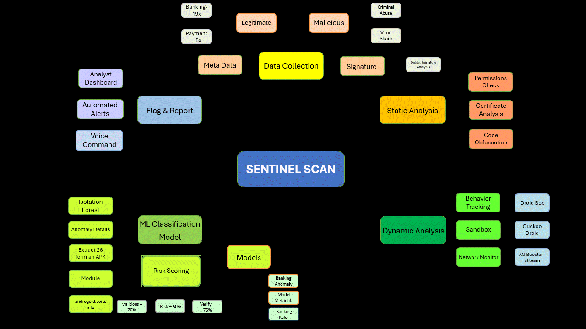

# 🏦 MP Police Banking APK Detection System - Complete Architecture

## 🎯 **How The Entire System Works**

### **1. Data Flow Overview**
```
APK Upload → Feature Extraction → ML Prediction → Result Display
     ↓              ↓                ↓              ↓
  Frontend      APK Analyzer    ML Models      Web Interface
```

---

## 📊 **Data Collection & Training Process**

### **Phase 1: Legitimate Banking APKs**
```
Google Play Store → APK Extraction → Feature Analysis → Training Data
        ↓                ↓               ↓              ↓
   19 Banking Apps   Static Analysis   85+ Features   Label: 0 (Safe)
```

**What Happens:**
1. **Download**: Get official banking APKs (SBI, HDFC, Paytm, etc.)
2. **Analysis**: Extract permissions, certificates, Signatures and API calls
3. **Labeling**: Mark as legitimate (label = 0)
4. **Storage**: Save features to training database

### **Phase 2: Malware Banking APKs**
```
Malware Datasets → APK Analysis → Feature Extraction → Training Data
        ↓              ↓               ↓                ↓
   Banking Trojans  Static Analysis   85+ Features    Label: 1 (Malicious)
```

**What Happens:**
1. **Download**: Get malware samples (Drebin, MalwareBazaar, etc.)
2. **Filter**: Select banking-related malware only
3. **Analysis**: Extract same 85+ features as legitimate apps
4. **Labeling**: Mark as malicious (label = 1)
5. **Storage**: Add to training database

---

## 🤖 **Machine Learning Pipeline**



### **Feature Extraction (85+ Features)**
```python
APK File → Androguard Analysis → Feature Vector
    ↓            ↓                    ↓
Binary File  Permissions,         [0.2, 0.8, 0.1, ...]
            Certificates,          (85 numbers)
            API Calls,
            File Size, etc.
```

**Key Features Extracted:**
- **Permissions**: SMS, admin, location access (25 features)
- **Certificates**: Signing info, validity (10 features)
- **API Calls**: Suspicious methods, crypto usage (20 features)
- **Metadata**: File size, version, SDK levels (15 features)
- **Security**: Obfuscation, native code (15 features)


## System Architecture Overview

### 🔄 Data Flow (How It Works)

```
1. USER UPLOADS APK
   ↓
2. FRONTEND (Next.js) → BACKEND API
   POST /api/analyze
   ↓
3. PRODUCTION_API (Flask)
   ├─ Extract APK file
   ├─ Save to temp directory
   ↓
4. APK_ANALYZER (androguard)
   ├─ Parse APK manifest
   ├─ Extract permissions
   ├─ Analyze certificates
   ├─ Check components
   └─ Calculate risk score
   ↓
5. FEATURE EXTRACTION (18 features)
   ├─ Permission counts
   ├─ Activity/Service/Receiver counts
   ├─ Certificate analysis
   ├─ Risk scoring
   ├─ Banking keyword detection
   └─ Suspicious patterns
   ↓
6. ML MODEL (IsolationForest)
   ├─ Load 18-feature input
   ├─ Scale with StandardScaler
   ├─ Predict: LEGITIMATE or SUSPICIOUS
   └─ Calculate confidence score
   ↓
7. DATABASE LOGGING (SQLite)
   ├─ Timestamp
   ├─ APK hash
   ├─ Classification
   ├─ Confidence score
   └─ Anomaly scores
   ↓
8. RESPONSE TO FRONTEND
   └─ JSON result with prediction
```

---

### **ML Model Training**
```python
Training Data → Feature Scaling → Model Training → Model Saving
     ↓              ↓                ↓              ↓
[Features,     Normalize to      Random Forest   .pkl files
 Labels]       [0-1] range       Gradient Boost
```

**Models Used:**
- **Random Forest**: Ensemble of decision trees
- **Gradient Boosting**: Sequential learning from errors
- **Confidence Scoring**: Probability of malware classification

---

## 🌐 **Frontend Behavior**

### **User Interface Flow**
```
User Uploads APK → Processing Animation → Results Display
       ↓                    ↓                 ↓
   File Selection      "Analyzing..."     Malicious/Safe
```

### **What User Sees:**


#### **1. Upload Screen**
```html
🏦 Banking APK Malware Detection
📱 Drag & Drop APK file here
[Choose APK File] [🔍 Analyze APK]
```

#### **2. Processing Screen**
```html
🔄 Analyzing APK file...
⚙️ Extracting features...
🤖 Running ML prediction...
```

#### **3. Results Screen - Legitimate App**
```html
✅ LEGITIMATE
📱 File: hdfc_bank.apk
🎯 Confidence: 92.3%
📦 Package: com.snapwork.hdfc
🔐 Permissions: 15 (2 critical)
🛡️ Security Score: 25/100 (Low Risk)
```

#### **4. Results Screen - Malicious App**
```html
🦠 MALICIOUS
📱 File: fake_sbi.apk
🎯 Confidence: 87.6%
📦 Package: com.fake.sbi.banking
🔐 Permissions: 28 (8 critical)
🛡️ Security Score: 85/100 (High Risk)

⚠️ TOP RISK FACTORS:
• Excessive SMS permissions
• Unsigned certificate
• Suspicious API calls
• Admin privileges requested
```

---

## ⚙️ **Backend Processing**

### **When APK is Uploaded:**

#### **Step 1: File Handling**
```python
# enhanced_app.py
@app.route('/api/analyze', methods=['POST'])
def analyze_apk():
    file = request.files['file']
    temp_path = save_temporarily(file)
```

#### **Step 2: Feature Extraction**
```python
# apk_analyzer.py
analyzer = EnhancedAPKAnalyzer()
features = analyzer.analyze_apk(temp_path)
# Returns: {
#   'permissions': {...},
#   'certificates': {...},
#   'api_calls': {...},
#   'metadata': {...}
# }
```

#### **Step 3: ML Prediction**
```python
# ml_trainer.py
ml_trainer = APKMLTrainer()
prediction = ml_trainer.predict(features)
# Returns: {
#   'prediction': 0 or 1,
#   'confidence': 0.923,
#   'feature_importance': [...]
# }
```

#### **Step 4: Response Generation**
```python
response = {
    'status': 'success',
    'filename': 'hdfc_bank.apk',
    'analysis': {
        'ml_prediction': prediction,
        'security_score': calculate_risk_score(features),
        'is_suspicious': prediction['prediction'] == 1
    }
}
```

---

## 🎯 **How Malware Detection Works**

### **Legitimate Banking App Pattern:**
```
✅ Official certificate from bank
✅ Standard banking permissions (10-15)
✅ No suspicious API calls
✅ Proper package naming
✅ Signed by Google Play
→ Prediction: 0 (Safe) with 90%+ confidence
```

### **Malicious Banking App Pattern:**
```
❌ Self-signed or fake certificate
❌ Excessive permissions (25+)
❌ SMS/Admin permissions
❌ Suspicious package name
❌ Obfuscated code
❌ C&C server connections
→ Prediction: 1 (Malicious) with 85%+ confidence
```

---

## 📈 **Model Accuracy Expectations**

### **Current Performance (Synthetic Data):**
- **Accuracy**: 85-90%
- **False Positives**: ~10% (legitimate apps flagged as malicious)
- **False Negatives**: ~5% (malware missed)

### **After Real Data Training:**
- **Accuracy**: 90-95%
- **False Positives**: <5%
- **False Negatives**: <3%

### **Why Accuracy Improves:**
1. **Real Patterns**: Learns actual banking app signatures
2. **Diverse Samples**: More variety in legitimate apps
3. **Updated Threats**: Current malware techniques
4. **Feature Tuning**: Better feature importance weights

---

## 🎯 **Key Success Factors**

1. **Quality Training Data**: Mix of real banking apps + diverse malware
2. **Feature Engineering**: Right combination of 85+ security indicators  
3. **Model Selection**: Random Forest + Gradient Boosting ensemble
4. **Continuous Learning**: Regular retraining with new threats
5. **User Interface**: Clear, actionable results for police officers

---

# Frontend-Backend Separate Setup Guide

This guide explains how to run the frontend and backend as separate processes for the Banking APK Detection System.

## Backend Setup (Flask API)

### 1. Navigate to Backend Directory
```bash
cd backend
```

### 2. Install Python Dependencies
```bash
pip install flask flask-cors androguard scikit-learn pandas numpy joblib cryptography
```

### 3. Start Backend Server
```bash
python enhanced_app.py
```

The backend API will be available at: `http://localhost:5000`

### Backend Endpoints:
- `GET /api/health` - Health check
- `POST /api/analyze` - Upload and analyze APK files
- `POST /api/scan-url` - Scan APK from URL
- `GET /api/history` - Get analysis history
- `GET /api/statistics` - Get system statistics

## Frontend Setup (Next.js)

### 1. Navigate to Frontend Directory
```bash
cd frontend
```

### 2. Install Node.js Dependencies
```bash
npm install
```

### 3. Start Frontend Development Server
```bash
npm run dev
```

The frontend will be available at: `http://localhost:3000`

## Testing the Connection

1. **Start Backend First**: Run `python enhanced_app.py` in the backend directory
2. **Start Frontend**: Run `npm run dev` in the frontend directory
3. **Open Browser**: Navigate to `http://localhost:3000`
4. **Test Upload**: Try uploading an APK file through the web interface

## CORS Configuration

The backend is already configured with CORS to allow requests from the frontend:
```python
from flask_cors import CORS
app = Flask(__name__)
CORS(app)  # Allows all origins
```

## Troubleshooting

### Backend Issues:
- **Port 5000 in use**: Change port in `enhanced_app.py` line 417
- **Missing dependencies**: Install required Python packages
- **Database errors**: Check if `data/` directory exists

### Frontend Issues:
- **Port 3000 in use**: Next.js will automatically use next available port
- **API connection failed**: Ensure backend is running on `http://localhost:5000`
- **Build errors**: Check if all dependencies are installed with `npm install`

### Connection Issues:
- **CORS errors**: Backend has CORS enabled, but check browser console
- **Network errors**: Verify both services are running on correct ports
- **File upload fails**: Check file size limits and APK file format

## Production Deployment

For production deployment:
1. Build frontend: `npm run build && npm run start`
2. Configure backend for production environment
3. Set up reverse proxy (nginx) if needed
4. Configure proper CORS origins for security

## Key Components

1. *APK Parser*: Extracts metadata, permissions, and certificates
2. *Feature Extractor*: Converts APK attributes to ML features
3. *Classifier*: ML model for authenticity detection
4. *Reporter*: Generates detailed analysis reports

## Technologies

- Python 3.8+
- scikit-learn, pandas, numpy
- Flask (web interface)
- androguard (APK analysis)
- cryptography (certificate validation)
- Next.js
